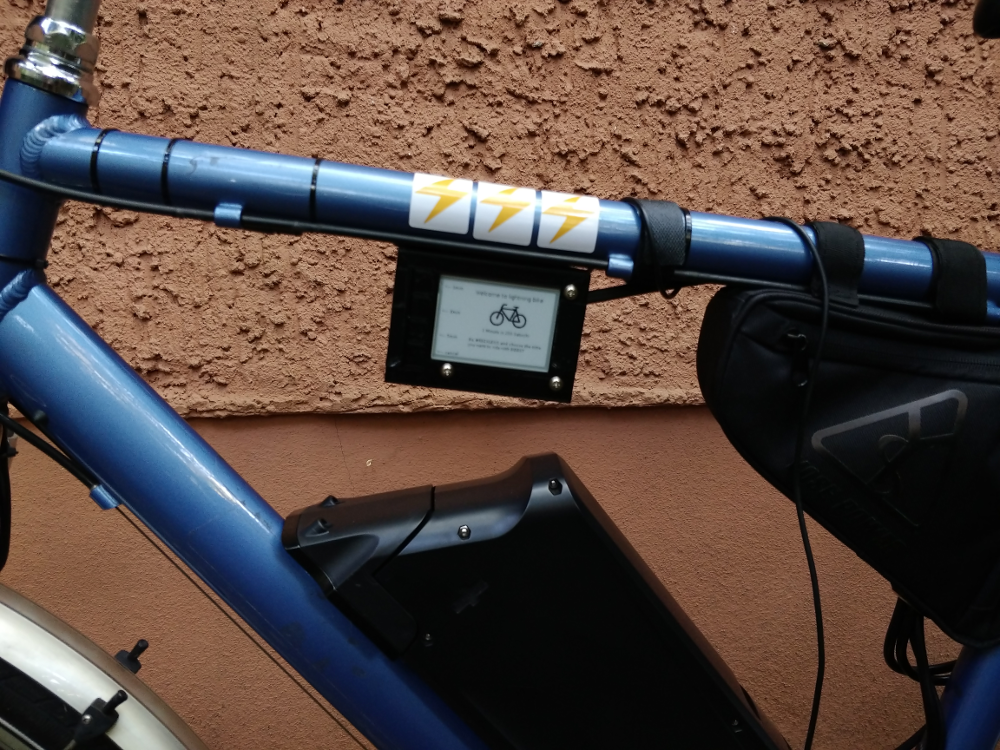
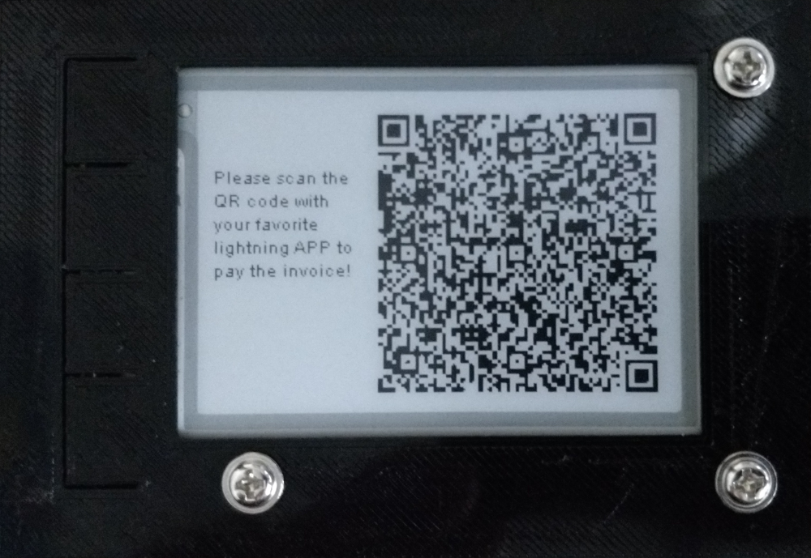
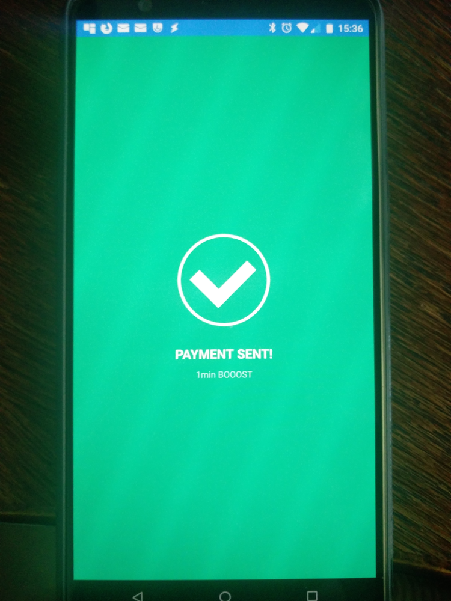
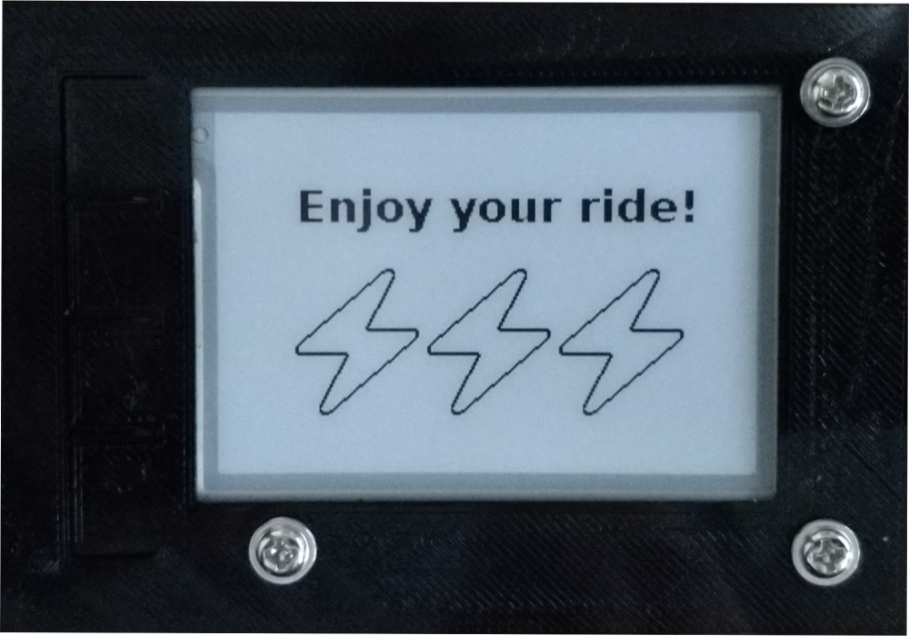

# ⚡lightning⚡ payable e-bike

Das lightning-bike ist ein e-bike (pedelec) dessen elektrische Unterstützung man für einen bestimmten Zeitraum buchen kann. 
Es benutzt lightning als Zahlungssystem um diese Funktion zu aktivieren. Man wählt am Display aus wie lange man fahren möchte, 
bekommt einen qr-code generiert den man mit seiner Handy lightning APP scannt und bezahlt, woraufhin der Strom für den gewählten
Zeitraum eingeschaltet wird. Das besondere an diesem System, es ist mobil, d.h. die Kommunikation wird über das Mobilfunknetzt
realisiert und die Stromversorgung über den Akkus des e-bikes.    

## Wie funktioniert es?

Der Client baut nach dem Bootvorgang automatisch mit der USB Netzwerkkarte eine Verbindung ins Internet auf. Das Programm startet
und das Display zeigt den Startbildschirm auf dem man momentan zwischen drei unterschiedlichen Zeiten der Benutzung wählen kann.
Pro Minute werden 250 Satochi verlangt. 

Der Kunde wählt den Zeitraum und das Programm generiert eine Zahlungaufforderung, die mittels lightning-charge an den node des
Servers übermittelt wird. Der Client bekommt die Zahlunginformationen vom Server zurück, generiert daraus einen qr-code welcher
dem Kunden auf dem Display angezeigt wird. Der Kunde hat nun 60 Sek. Zeit den qr-code mit seiner lightning APP im Handy zu scannen
und zu bezahlen. Solange testet der Client beim Server ob die Rechnung als bezahlt ausgewiesen wird.

Hat die Bezahlung funktioniert wird der Strom vom System für die gewählt Zeit eingeschaltet und man kann los fahren!!! 
Nach dem Ende der bezahlten Zeit schaltet das System ab und die Stromzufuhr wird unterbrochen - man kann natürlich weiter fahren,
aber nur noch mit Muskelkraft. Das Programm kehrt zum Startbildschirm zurück und man kann wieder neue Zeit buchen. Hat es nicht 
funktioniert, wird der Startbildschirm aufgerufen und man kann es nochmal probieren.

## Systemaufbau:

Herz des System ist ein Raspberry Pi Zero WH, welcher sowohl die Anbindung an das Mobilnetz als auch die Schaltung der 
Stromzufuhr duch ein Relais steuert. Als Monitor kommt ein e-paper Display zum Einsatz, welches praktischweise auch gleich 
4 Druckschalter für die Steuerung zur Verfügung stellt. Das e-paper Display habe ich genommen da es im Anzeigemodus so gut wie 
keinen Strom verbraucht eigentlich nur wenn sich der Bildinhalt ändert. Es ist auch an sonnigen Tage gut lesbar und hat 
einen hohen Kontrast. Der Bildaufbau ist zwar mit ca. 6 Sek. relativ zäh, aber es werden eigenlich nur 2 Schritte/Bilder
benötigt um den Bezahlvorgang zu erledigen.  

Auf der Serverseite gibt es einen Raspberry Pi 3 B auf dem ein auf c-lightning https://github.com/ElementsProject/lightning 
basierender lightning node installiert ist. Diese Installation unterscheidet sich nur dadurch, das kein kompletter Bitcoin 
fullnode installiert ist. Ich verwende den pseudonode sPRUNED https://github.com/gdassori/spruned/ was den Vorteil hat, dass
ich nur ca. 300MB für die bitcoin blockchain benötige. Dieser Schritt ist optional und nicht für die Umsetztung erforderlich, 
aber ich wollte gerne mehr über die Stabilität von sPRUNED erfahren. Wer noch keine bitcoin fullnode betreibt sollte lieber damit
beginnen, es läuft etwas stabiler und stärkt gleichzeitig das bitcoin Netzwerk! Für die Steuerung des lightning nodes wird die
lightning-charge API https://github.com/ElementsProject/lightning-charge verwendet. Das war der Hauptgrund für mich die 
c-lightning implementierung zu wählen. Damit war dann sehr einfach die Progammierung der Bezahlungvorgänge umzusetzen.

Auf der Clienseite habe ich darauf geachtet möglichst stromsparende Komponenten zu verwenden, deshalb viel meine Wahl 
auf einen raspberry Pi Zero WH mit einem e-paper Display. Problematischer im Stromverbrauch ist sicher die USB Modem/Netzwerkkarte,
da gibt es vielleicht besseres. Das Relais zum Schalten des Stroms wird klassich über GPIO angesteuert und auch die 
4 Druckschalter des e-paper werden über GPIO abgefragt.

### Bauteile Server:
- Raspberry Pi 3
- 16GB microSD Karte (Sandisk)
- Standardgehäuse schwarz
- microUSB Kabel
- Netzteil
- Netzwerkkabel

### Bauteile Client:
- Raspberry Pi Zero WH
- 16GB microSD Karte (Sandisk)
- Waveshare 2.7inch E-Ink display 264x176 px 
- Huawei Technologies Co., Ltd. USB Modem/Networkcard
  (prepaid von Tchibo :-) (Provider Netz O2)
- 1 Kanal Relais 5V/230V
- microUSB Kabel
- Kabel, Lötzinn, Heißkleber, Montageband usw.
- Selbst entworfenes Gehäuse aus PLA mit einem 3D Drucker (tevo tarantula) ausgedruckt

## Zum Fahrrad:

Ein normales 28er Herrenrad mit Kettenschaltung, welches ich mit einem Umbausatz der Firma YOSE Power(Ebay) 
in ein Pedelec verwandelt habe. Der Umbausatz mit 250W Frontmotor entspricht den rechtlichen Bestimmungen, 
darf also ohne weiteres im Straßenverkehr benutzt werden. Auf den Umbau gehe ich hier nicht weiter ein, 
das ist eine Geschichte für sich!

